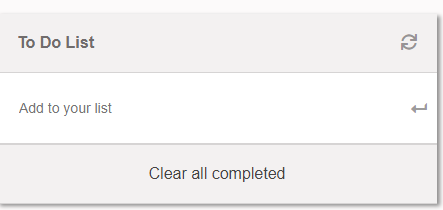
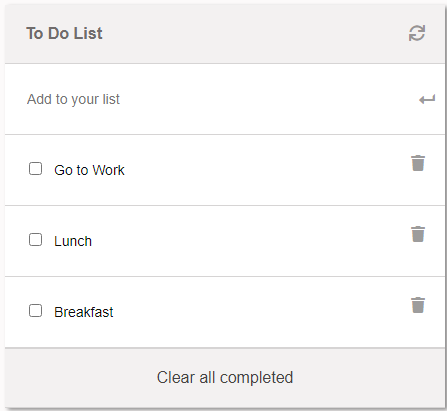
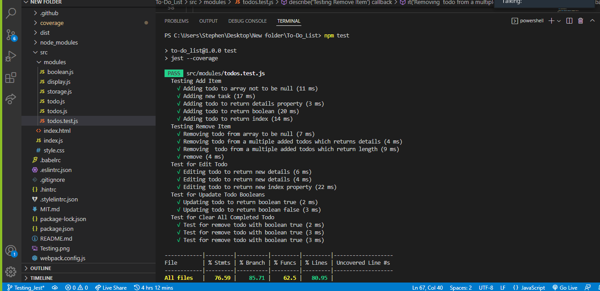

# TO-DO-LIST

> To-do lists offer a way to increase productivity, stopping you from forgetting things, helps prioritise tasks, manage tasks effectively, use time wisely and improve time management as well as workflow.

## Built With

- HTML
- Javascript
- CSS

To get a local copy up and running follow these simple example steps.

1. Clone Repository
   ```
   git clone https://github.com/braincee/To-Do_List.git
   ```

### Install linters(webhint, stylelint, eslint)

1. Run to install webhint
   ```
   npm install --save-dev hint@6.x
   ```
2. Run to install stylelint
   ```
   npm install --save-dev stylelint@13.x stylelint-scss@3.x stylelint-config-standard@21.x stylelint-csstree-validator@1.x
   ```
3. Run to install eslint
   ```
   npm install --save-dev eslint@7.x eslint-config-airbnb-base@14.x eslint-plugin-import@2.x babel-eslint@10.x
   ```

----

## Screenshots of Todo List

  

----

## Live Demo 🔗

Check the live demo [here](https://braincee.github.io/To-Do_List/)👈

----


### Screenshot of Testing with Jest 




----

## Author

👤 **Stephen**

- GitHub: [@braincee](https://github.com/braincee)
- Twitter: [@annor0543](https://twitter.com/annor0543)
- LinkedIn: [Stephen Annor](https://www.linkedin.com/in/kwesi-appiah-1387801a1/)

----


## 🤝 Contributing

Contributions, issues, and feature requests are welcome!

Feel free to check the [issues page](https://github.com/braincee/To-Do_List/issues).

## Show your support.

Give a ⭐️ if you like this project!

## Acknowledgments

- README template from [Microverse](https://github.com/microverseinc/readme-template)
- Linter setup from [Microverse](https://github.com/microverseinc/linters-config/tree/master/html-css)

## 📝 License

This project is [MIT](./MIT.md) licensed.
